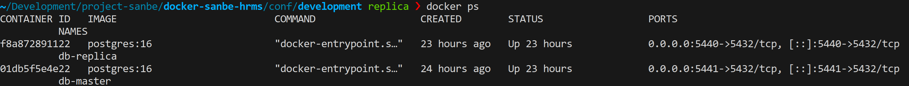
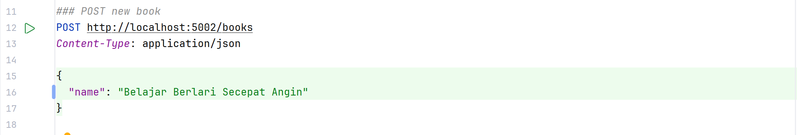
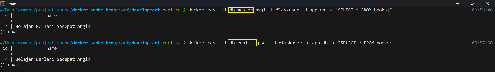

# Replikasi PostgreSQL

Project replikasi ini di install bersamaan dengan aplikasi flask sebagai API. Namun, jika tidak ingin install flask.
step install Flask bisa di lewati.

## Project Tech Stack
Pada project ini, ada 3 aplikasi yang akan di install. Semuanya menggunakan docker compose. Berikut tech stack yang digunakan:
- Docker
- PostgreSQL versi 16
- Flask
- Python 3.11

## Setup Master
Pada master, ada dua aplikasi: Flask & PostgreSQL.

Jika tidak ingin menggunakan flask, skip bagian setup flask ini dan comment seluruh konfigurasi
flask pada `./docker-compose.yaml`.

Buat python virtual environment.
```commandline
python3 -m venv .venv
```

Activate python environment.
```commandline
source .venv/bin/activate
```

Install semua pip requirement.
```commandline
pip install -r requirements.txt
```

Jika sudah, jalankan docker compose di root directory.
```commandline
docker compose up -d
```

Lalu cek apakah master sudah up.
```commandline
docker ps
```
Seharusnya ada container yang berjalan dengan nama **db-master** & **app-flask**.

## Proses Replica Database

### Buat role replica
Buat role khusus untuk proses replikasi, tanpa adanya role ini, proses replikasi tidak bisa dilakukan.
Jalankan di database master.
```postgresql
CREATE ROLE replicator WITH REPLICATION LOGIN PASSWORD 'replicator123';
```

Lalu pastikan jika role sudah berhasil dibuat di master.
```postgresql
SELECT
    rolname,
    rolcanlogin,
    rolreplication
FROM
    pg_roles
WHERE
    rolname = 'nama_user_replikasi';
```

### Buat replica slot untuk handle WAL
Tanpa replica slot, setiap WAL akan langsung di hapus.
```postgresql
SELECT * FROM pg_create_physical_replication_slot('standby_slot1');
```

Lalu pastikan jika replica slot sudah berhasil dibuat.
```postgresql
SELECT
    slot_name,
    slot_type,
    active
FROM
    pg_replication_slots
WHERE
    slot_name = 'nama_slot_anda';
```

### Buat docker volume
Buat docker volume untuk database replica.
```commandline
docker volume create db-replica
```

### Buat docker network
Buat docker network untuk digunakan container replica.
```commandline
docker network create flask_async_network
```

### Setup postgresql di master
Berikut ini adalah setup minimal yang dibutuhkan untuk proses replikasi dengan streaming data async.
```editorconfig
wal_level=replica
max_wal_senders=10
max_wal_size=2GB
min_wal_size=512MB
wal_keep_size=64
max_replication_slots=3
synchronous_commit=off # Kunci Async, memastikan commit tidak menunggu write di disk replica 
wal_compression=on
full_page_writes=on
archive_mode=on
listen_addresses='*'
```

Jika ingin mengubah streaming replication dari Async menjadi Sync, gunakan konfigurasi berikut:
```editorconfig
synchronous_commit=remote_write
synchronous_standby_names= 'FIRST 1 (walreceiver)' 
```

### Setup pg_hba di master
Pastikan role replica di daftarkan di pg_hba.conf dan digunakan pada master.
```editorconfig
# TYPE  DATABASE        USER            ADDRESS                 METHOD
host    replication     replicator        172.29.0.0/16           scram-sha-256
```
Untuk Address `172.29.0.0/16 ` mengikuti assignment pada docker network. Bisa dicek dengan command berikut:
```commandline
docker inspect dev-odoo-santosa | grep -i gateway
```

nanti akan muncul sebagai berikut:
```editorconfig
"Gateway": "", 
"IPv6Gateway": "",
         "Gateway": "172.29.0.1",
         "IPv6Gateway": "",
```

Gunakan __172.29.0.0__ , bukan ~~172.29.0.1~~

### Jalankan proses replikasi
Untuk proses replikasi, gunakan *pg_basebackup*
```commandline
docker run --rm -e PGPASSWORD=replicator123 --network flask_async_network \
  -v db-replica:/backup \
  postgres:16 pg_basebackup \
  -h db-master \
  -U replicator \
  -D /backup \
  -p 5432 -R -P -S standby_slot1
```

### Jalankan docker compose untuk replica
Sekarang kita jalankan container replica. Sebelumnya kita melakukan replikasi dari master
ke docker volume. Idenya, volume ini akan digunakan oleh container replica.

```commandline
cd replica/ && docker compose up -d
```

## Testing Replica
Sekarang, pastikan bahwa proses replikasi berjalan sukses. Pertama, pastika semua container up.
```commandline
docker ps
```

Hasilnya akan seperti dibawah,


Saya akan menjalankan proses insert data menggunakan API POST di flask.


Lalu kita cek, apakah record tersebut ada di kedua database. Kamu bisa cek record langsung di
database melalui database client seperti dbeaver atau datagrip.

Saya akan menggunakan command line


## Query Monitoring
Monitoring replikasi database sangatlah penting untuk memastikan bahwa semua data
dari master berhasil direplikasi.

Minimal ada 3 hal yang harus di monitoring.
1. Status koneksi standby
2. Kesehatan replication slot
3. Tingkat lag (keterlambatan)

Jalankan query dibawah ini pada database master
```postgresql
-- monitoring healthy | lag time <= 5detik size <= 10MB
WITH replication_status AS (
    SELECT
        'Replication Overview' AS info_type,
        application_name,
        client_addr::text,
        state,
        sync_state,
        pg_size_pretty(pg_wal_lsn_diff(pg_current_wal_lsn(), replay_lsn)) AS lag_size,
        EXTRACT(EPOCH FROM replay_lag)::text || ' seconds' AS lag_time,
        CASE
            WHEN state != 'streaming' THEN '❌ NOT STREAMING'
            WHEN pg_wal_lsn_diff(pg_current_wal_lsn(), replay_lsn) > 104857600 THEN '🔴 CRITICAL (>100MB)'
            WHEN pg_wal_lsn_diff(pg_current_wal_lsn(), replay_lsn) > 10485760 THEN '🟡 WARNING (>10MB)'
            WHEN replay_lag > interval '5 seconds' THEN '🟡 WARNING (>5s)'
            ELSE '🟢 HEALTHY'
            END AS health_status,
        CASE
            WHEN backend_start IS NOT NULL THEN '✅ CONNECTED'
            ELSE '❌ DISCONNECTED'
            END AS connection_status
    FROM pg_stat_replication

    UNION ALL

    SELECT
        'Replication Slot Status' AS info_type,
        slot_name AS application_name,
        NULL::text AS client_addr,
        CASE WHEN active THEN 'active' ELSE 'inactive' END AS state,
        NULL AS sync_state,
        pg_size_pretty(pg_wal_lsn_diff(pg_current_wal_lsn(), restart_lsn)) AS lag_size,
        NULL::text AS lag_time,
        CASE
            WHEN NOT active THEN '❌ SLOT INACTIVE'
            WHEN pg_wal_lsn_diff(pg_current_wal_lsn(), restart_lsn) > 1073741824 THEN '🔴 CRITICAL (>1GB WAL)'
            WHEN pg_wal_lsn_diff(pg_current_wal_lsn(), restart_lsn) > 104857600 THEN '🟡 WARNING (>100MB WAL)'
            ELSE '🟢 HEALTHY'
            END AS health_status,
        CASE
            WHEN active THEN '✅ ACTIVE'
            ELSE '❌ NOT ACTIVE'
            END AS connection_status
    FROM pg_replication_slots
    WHERE slot_type = 'physical'
)
SELECT * FROM replication_status

UNION ALL

SELECT
    'No Replica Alert' AS info_type,
    NULL::text AS application_name,
    NULL::text AS client_addr,
    NULL AS state,
    NULL AS sync_state,
    NULL AS lag_size,
    NULL::text AS lag_time,
    '🔴 NO REPLICA CONNECTED' AS health_status,
    '❌ DISCONNECTED' AS connection_status
WHERE NOT EXISTS (SELECT 1 FROM pg_stat_replication);
```

## Kesimpulan
Project ini merupakan dummy project untuk PoC (proof of concept) PostgreSQL Replication
dengan metode streaming data Async. Project dibuat menggunakan docker container.

Pentingnya monitoring untuk mengetahui sukses atau tidaknya proses replikasi.

Terimakasih!!!